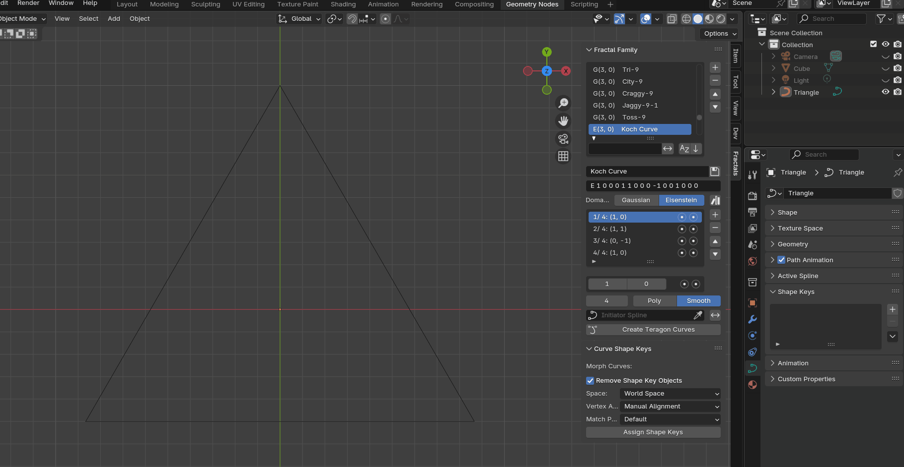

# Fractal Family Generator for Blender

 

A Blender add-on for generating fractal curves using mathematical definitions in Gaussian and Eisenstein integer domains.

## Features

- 🌀 **Fractal Curve Generation**
  - Supports both Gaussian (G) and Eisenstein (E) integer domains
  - Customizable complex integer coordinates
  - Transform flags for mirroring and reversing
  - Multiple generation levels (1-20)

- 📚 **Preset Management**
  - Save/Load fractal curve definitions
  - Predefined fractal curve collections
  - Family-based organization of presets

- ✨ **Advanced Controls**
  - Poly/Smooth spline types
  - Custom initiator spline

- 🎬 **Animation between iteration levels**

  While this add-on does not directly support animation generation, it creates curves for each level and subdivides them, preparing them for shape keys. Use the official add-on [Assign Shape Keys](https://extensions.blender.org/add-ons/assign-shape-keys) to convert the level curves to shape keys. In the shape key panel, disable the `Relative` checkbox and slide the `Evaluation Time` to view the animation between each level.

- 🖥️ **Intuitive UI**
  - 3D View sidebar integration
  - Interactive list controls
  - Visual transform indicators

## Usage

1. Open the `Fractals` panel in the 3D View sidebar.
2. **Preset Management**:
   - Load predefined curves using the asset manager button.
   - Select a preset from the preset list.
   - Save custom configurations using the file tick button (if changes are made and you want to persist them).
   
3. **Curve Definition** (Optional):
   - Add/Edit complex integer pairs.
   - Set transform flags (Mirror/Reverse).
   - Select domain type (Gaussian/Eisenstein).
       
> [!TIP]
> Experiment with different integer pairs and transform combinations to discover new fractal patterns!

4. **Generation**:
   - Choose spline type (Poly/Smooth).
   - Set fractal level (1-20).
   - Optionally select an initiator spline.
   - Click `Create Teragon Curves` to generate.

5. ​**Animation**
   - This add-on does not directly create animations. Instead, it generates curves (from the last step) for each level and subdivides them, preparing them for shape keys.
   - Install the official add-on [Assign Shape Keys](https://extensions.blender.org/add-ons/assign-shape-keys).
   - Ensure only the curves created by last step are selected (the first one is the active object).
   - Open the `Edit` panel in the 3D View sidebar, locate the `Curve Shape Keys` panel, and click the `Assign Shape Keys` button, keeping all options at their default settings.
   - Only one curve object will remain. In the `Property Editor` -> `Shape Keys` panel, disable the `Relative` checkbox and adjust the `Evaluation Time` slider to view the animation between each level.

## Limitations

1. Currently, only the X-Y plane is supported due to the algorithm's design. If you need other planes, generate the curves and rotate them manually.
2. This add-on cannot generate all types of fractal curves. It only supports `Edge Replacement` fractal curves using the complex integer lattice system. `Node Replacement` fractal curves (e.g. Hilbert Curve) are not supported. For these, consider using L-System or other methods.

## Technical Details

**Core Algorithm**:

[*The Family Tree of Fractal Curves: A taxonomy of plane-filling curves using complex integer lattices*](http://www.fractalcurves.com/familytree/) by *Jeffrey Ventrella*

The algorithms behind fractal curve generation combine mathematical principles of recursive subdivision and geometric transformation. At their core, these systems use iterative replacement rules where simple geometric patterns evolve into complex structures through repeated applications of transformation matrices. The mathematical foundation lies in complex integer frameworks, particularly Gaussian (G) and Eisenstein (E) integers, which define coordinate systems for planar curve generation through modular arithmetic operations.

**Key Concepts**:
- **Edge Replacement Rules**: Basic geometric elements substitute line segments at each iteration while maintaining endpoint connectivity.
- **Space-Filling Mechanisms**: Continuous mappings from 1D lines to 2D planes achieved through angle-controlled folding patterns that guarantee complete area coverage after infinite iterations.
- **Matrix Transformations**: Complex integer coordinates drive affine transformations (rotation, scaling, translation) applied at each subdivision level.

**Generation Process**:
1. Define the initial motif using base polygons or line segments.
2. Recursively apply replacement rules with scaling factors.
3. Perform coordinate transformations using complex number arithmetic.

**Data Structure**:
- Curve definitions stored as complex integer pairs + transform flags.
- JSON-based preset system (`presets.json`).

## Requirements
- Blender 4.2+
- Python 3.7+

## License
[SPDX:GPL-3.0-or-later](LICENSE)
